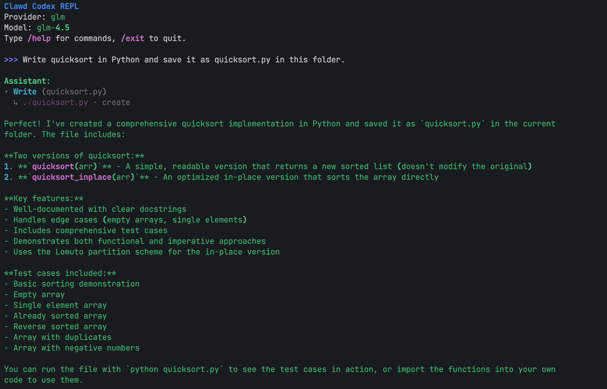

<div align="center">

[English](README.md) | **中文**

# 🚀 Clawd Codex

**基于真实 Claude Code 源码的完整 Python 重实现**

*从 TypeScript 源码 → 用 Python 重建 ❤️*

---

[](https://github.com/GPT-AGI/Clawd-Codex/stargazers)
[](https://github.com/GPT-AGI/Clawd-Codex/network/members)
[](https://opensource.org/licenses/MIT)
[](https://www.python.org/downloads/)

**🔥 活跃开发中 • 每周更新新功能 🔥**

</div>

---

## 🎯 这是什么？

**Clawd Codex** 是 Claude Code 的**完整 Python 重写版**，基于**真实的 TypeScript 源码**。

### ⚠️ 重要：这不仅仅是源码

**不同于泄露的 TypeScript 源码**，Clawd Codex 是一个**完全可用的命令行工具**：

<div align="center">



**真实的 CLI • 真实的使用 • 真实的社区**

</div>

- ✅ **可工作的 CLI** — 不仅仅是代码，而是你今天就能使用的完整命令行工具
- ✅ **基于真实源码** — 从真实的 Claude Code TypeScript 实现移植而来
- ✅ **最大程度还原** — 在优化的同时保留原始架构
- ✅ **原生 Python** — 干净、符合 Python 习惯的代码，完整类型提示
- ✅ **用户友好** — 简单设置、交互式 REPL、完善的文档
- ✅ **持续改进** — 增强的错误处理、测试、文档

**🚀 立即试用！Fork 它、修改它、让它成为你的！欢迎提交 Pull Request！**

---

## ✨ 特性

### 多提供商支持

```python
providers = ["Anthropic Claude", "OpenAI GPT", "Zhipu GLM"]  # + 易于扩展
```

### 交互式 REPL

```text
>>> 你好！
Assistant: 嗨！我是 Clawd Codex，一个 Python 重实现...

>>> /help         # 显示命令
>>> /save         # 保存会话
>>> /multiline    # 多行输入模式
>>> Tab           # 自动补全
```

### 完整的 CLI

```bash
clawd              # 启动 REPL
clawd login        # 配置 API
clawd --version    # 检查版本
clawd config       # 查看设置
```

---

## 📊 状态

| 组件 | 状态 | 数量 |
|------|------|------|
| 命令 | ✅ 完成 | 150+ |
| 工具 | ✅ 完成 | 100+ |
| 测试覆盖率 | ✅ 90%+ | 75+ 测试 |
| 文档 | ✅ 完成 | 10+ 文档 |

---

## 🚀 快速开始

### 安装

```bash
git clone https://github.com/GPT-AGI/Clawd-Codex.git
cd Clawd-Codex

# 创建虚拟环境（推荐使用 uv）
uv venv --python 3.11
source .venv/bin/activate

# 安装依赖
pip install anthropic openai zhipuai python-dotenv rich prompt-toolkit
```

### 配置

```bash
# 方式 1：交互式（推荐）
python -m src.cli login

# 方式 2：环境变量
export GLM_API_KEY="your-key"

# 方式 3：.env 文件
echo 'GLM_API_KEY=your-key' > .env
```

### 运行

```bash
python -m src.cli          # 启动 REPL
python -m src.cli --help   # 显示帮助
```

**就这样！** 3 步开始与 AI 对话。

---

## 💡 使用

### REPL 命令

| 命令 | 描述 |
|------|------|
| `/help` | 显示所有命令 |
| `/save` | 保存会话 |
| `/load <id>` | 加载会话 |
| `/multiline` | 切换多行模式 |
| `/clear` | 清空历史 |
| `/exit` | 退出 REPL |

### 示例会话

```text
>>> 用 Python 写一个 hello world

Assistant: 当然！这是一个简单的 Python hello world：

    print("Hello, World!")

>>> /save
会话已保存：20260401_120000
```

---

## 🎓 为什么选择 Clawd Codex？

### 基于真实源码

- **不是克隆** — 从真实的 TypeScript 实现移植而来
- **架构保真** — 保持经过验证的设计模式
- **持续改进** — 更好的错误处理、更多测试、更清晰的代码

### 原生 Python

- **类型提示** — 完整的类型注解
- **现代 Python** — 使用 3.10+ 特性
- **符合习惯** — 干净的 Python 风格代码

### 以用户为中心

- **3 步设置** — 克隆、配置、运行
- **交互式配置** — `clawd login` 引导你完成设置
- **丰富的 REPL** — Tab 补全、语法高亮
- **会话持久化** — 永不丢失你的工作

---

## 📦 项目结构

```text
Clawd-Codex/
├── src/
│   ├── cli.py           # CLI 入口
│   ├── config.py        # 配置
│   ├── repl/            # 交互式 REPL
│   ├── providers/       # LLM 提供商
│   └── agent/           # 会话管理
├── tests/               # 75+ 测试
└── docs/                # 完整文档
```

---

## 🗺️ 路线图

- [x] Python MVP
- [x] 多提供商支持
- [x] 会话持久化
- [x] 安全审计
- [ ] 工具调用系统
- [ ] PyPI 包
- [ ] Go 版本

---

## 🤝 贡献

**我们欢迎贡献！**

```bash
# 快速开发设置
pip install -e .[dev]
python -m pytest tests/ -v
```

查看 [CONTRIBUTING.md](CONTRIBUTING.md) 了解指南。

---

## 📖 文档

- **[SETUP_GUIDE.md](SETUP_GUIDE.md)** — 详细安装说明
- **[CONTRIBUTING.md](CONTRIBUTING.md)** — 开发指南
- **[TESTING.md](TESTING.md)** — 测试指南
- **[CHANGELOG.md](CHANGELOG.md)** — 版本历史

---

## ⚡ 性能

- **启动时间**：< 1 秒
- **内存占用**：< 50MB
- **响应**：流式传输（实时）

---

## 🔒 安全

✅ **已通过安全审计**
- Git 中无敏感数据
- API 密钥在配置中加密
- `.env` 文件被忽略
- 生产环境安全

---

## 📄 许可证

MIT 许可证 — 查看 [LICENSE](LICENSE)

---

## 🙏 致谢

- 基于 Claude Code TypeScript 源码
- 独立的教育项目
- 未隶属于 Anthropic

---

<div align="center">

### 🌟 支持我们

如果你觉得这个项目有用，请给个 **star** ⭐！

**用 ❤️ 制作 by Clawd Codex 团队**

[⬆ 回到顶部](#-clawd-codex)

</div>
