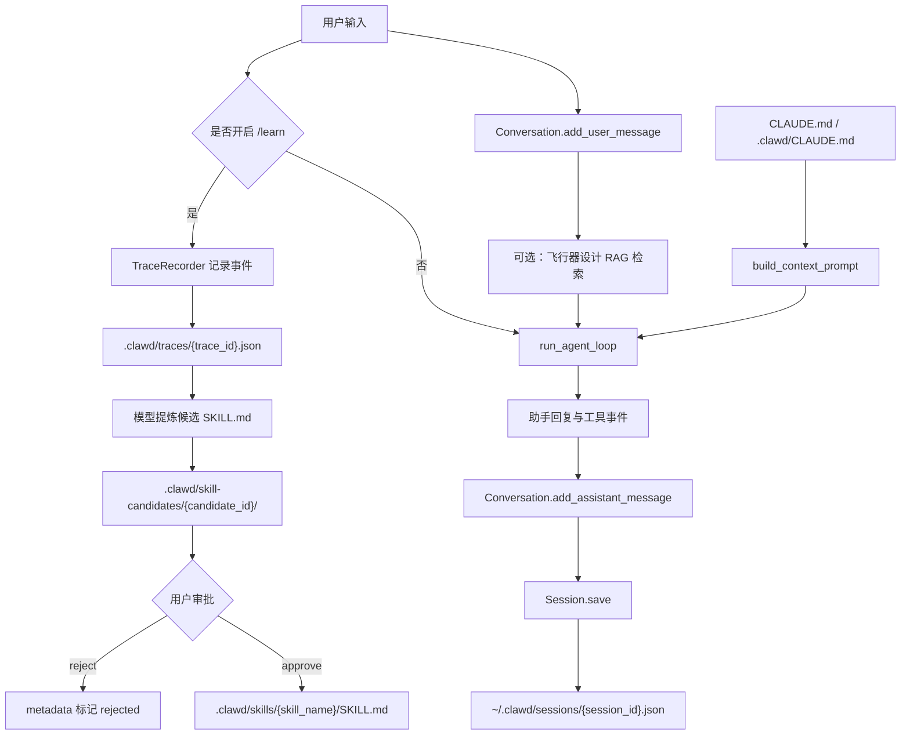

# 记忆机制说明

本文档说明当前 Clawd-Code 项目中的记忆机制。这里的“记忆”不是单一的向量数据库或黑盒长期记忆，而是由会话持久化、网页端会话恢复、显式技能学习、项目指令文件和飞行器设计资料检索缓存共同组成的一套本地文件化机制。

## 总体结论

当前项目的记忆机制可以分为五层：

| 层级 | 作用 | 主要文件 | 存储位置 |
| --- | --- | --- | --- |
| 会话记忆 | 保存用户与助手的多轮对话、工具事件和模型信息 | `src/agent/session.py`、`src/agent/conversation.py` | `~/.clawd/sessions/*.json` |
| 网页端会话恢复 | Web UI 重启后恢复历史会话、支持删除和重置 | `src/web/app.py` | 同上 |
| CLI 输入历史 | 保存终端输入历史，方便上下键召回 | `src/repl/core.py` | `~/.clawd/history` |
| 技能学习记忆 | 将显式 `/learn` 的任务轨迹提炼成可复用 Skill | `src/skill_memory.py` | `.clawd/traces/`、`.clawd/skill-candidates/`、`.clawd/skills/` |
| 项目指令记忆 | 将 `CLAUDE.md` 等长期项目说明注入上下文 | `src/context_system/claude_md.py`、`src/context_system/builder.py` | `CLAUDE.md`、`.clawd/CLAUDE.md`、`.claude/CLAUDE.md` |
| 飞行器设计资料缓存 | 为 RAG 检索维护本地索引，不是用户会话记忆 | `src/web/rag_service.py`、`src/web/app.py` | `.clawd/cache/rag_index_*` |

在服务器部署环境中，如果 Web 服务由 `liusongyang2025` 用户运行，那么网页端会话历史实际保存在：

```text
/home/liusongyang2025/.clawd/sessions/
```

本地开发环境则保存在当前用户的：

```text
~/.clawd/sessions/
```

## 1. 会话记忆：Session 与 Conversation

会话记忆的核心实现由两个类组成：

- `Session`：保存一次会话的元信息和完整对话。
- `Conversation`：保存消息列表，并负责序列化、反序列化和 API 格式转换。

相关文件：

```text
src/agent/session.py
src/agent/conversation.py
```

### Conversation 数据结构

`Conversation` 内部维护：

```python
messages: list[Message]
max_history: int = 100
```

每条消息是一个 `Message`：

```python
role: str
content: str | list[ContentBlock]
reasoning_content: str | None
events: list[dict]
timestamp: str
_is_internal: bool
```

其中：

- `role` 表示消息角色，通常是 `user`、`assistant` 或 `system`。
- `content` 可以是普通文本，也可以是工具调用块和工具结果块。
- `reasoning_content` 用于保存 provider 暴露出来的 reasoning 字段。
- `events` 用于保存工具调用、检索、权限判断等过程事件，网页端的过程可见化主要依赖这类数据。
- `timestamp` 保存消息生成时间。
- `_is_internal` 用于标记内部消息，例如压缩边界，发送给模型时会被过滤。

`Conversation` 的历史上限默认为 100 条消息。如果消息数量达到上限，再加入新消息时会移除最早的一条：

```python
if len(self.messages) >= self.max_history:
    self.messages.pop(0)
```

### 支持的内容块

项目中定义了三类内容块：

```python
TextContentBlock
ToolUseContentBlock
ToolResultContentBlock
```

它们分别表示：

- 普通文本。
- assistant 发起的工具调用。
- user 角色回传的工具执行结果。

这使得项目可以把普通聊天、工具调用、多轮工具结果全部保存到同一套会话结构中。

### 序列化与反序列化

`Conversation.to_dict()` 会将消息列表转成 JSON 友好的字典结构。

`Conversation.from_dict()` 会从磁盘 JSON 恢复 `Conversation` 对象。

`Conversation.get_messages()` 会把内部消息转换成 provider API 需要的格式，并跳过 `_is_internal=True` 的内部消息。

## 2. Session 持久化

`Session` 是真正落盘的会话对象，包含：

```python
session_id
provider
model
conversation
created_at
updated_at
```

保存逻辑在：

```text
src/agent/session.py
```

保存路径固定为：

```text
~/.clawd/sessions/{session_id}.json
```

保存内容大致结构如下：

```json
{
  "session_id": "20260603_082002_bf9b9a",
  "provider": "openai",
  "model": "deepseek-v4-pro",
  "conversation": {
    "messages": [],
    "max_history": 100
  },
  "created_at": "...",
  "updated_at": "..."
}
```

加载时，`Session.load(session_id)` 会从同一目录读取 JSON，并通过 `Conversation.from_dict()` 还原对话。

这意味着：只要 `~/.clawd/sessions/` 下的 JSON 文件还在，历史会话就具备恢复条件。

## 3. 网页端会话恢复机制

网页端服务在：

```text
src/web/app.py
```

网页端维护一个运行时状态类：

```python
WebSessionState
```

它包含：

```python
session
provider_name
provider
tool_registry
tool_context
auto_approve
auto_skill
rag_settings
lock
```

其中 `session` 仍然是前面介绍的 `Session` 对象。网页端并没有单独设计一套数据库，而是复用 `Session.save()` 进行落盘。

### 新建会话

网页端新建会话时：

1. 读取配置，选择 provider 和模型。
2. 创建 `Session`。
3. 给 `session_id` 追加随机后缀，避免多个 Web 会话同秒创建时冲突。
4. 构造 `WebSessionState`。
5. 写入内存字典 `_sessions`。
6. 调用 `session.save()` 写入磁盘。

### 发送消息

网页端每次发送消息时：

1. 根据 `session_id` 找到 `WebSessionState`。
2. 将用户消息加入 `Conversation`。
3. 如果启用了飞行器设计资料能力，先检索 RAG，并把证据附加到本轮输入。
4. 调用 `run_agent_loop()`。
5. 将工具事件序列化，附加到最新 assistant 消息上。
6. 调用 `state.session.save()` 保存完整会话。

所以网页端每轮对话结束后，都会刷新磁盘中的会话 JSON。

### 服务重启后的恢复

网页端服务初始化时会调用：

```python
_restore_persisted_sessions()
```

这个方法会扫描：

```text
~/.clawd/sessions/*.json
```

然后逐个调用 `Session.load(session_id)` 恢复历史会话。

如果 provider 配置缺失、API Key 不存在或模型初始化失败，该会话不会被恢复到网页端内存状态中。这一点很重要：历史文件存在并不代表一定能出现在前端列表里，恢复还依赖当前运行环境的 provider 配置。

### 删除会话

网页端删除会话时：

1. 从内存 `_sessions` 中移除。
2. 删除磁盘文件：

```text
~/.clawd/sessions/{session_id}.json
```

如果会话正在运行并持有锁，会拒绝删除，避免边写边删导致状态不一致。

## 4. CLI 侧历史

CLI 侧有两类历史：

### 输入历史

命令行输入历史由 prompt-toolkit 的 `FileHistory` 保存，路径是：

```text
~/.clawd/history
```

它只用于终端上下键召回输入，不等于模型上下文记忆。

### 会话保存与加载

CLI 中的：

```text
/save
/load <session-id>
/clear
```

分别对应：

- `/save`：调用 `self.session.save()` 保存当前会话。
- `/load <session-id>`：调用 `Session.load(session_id)` 读取历史会话。
- `/clear`：调用 `self.session.conversation.clear()` 清空当前对话。

这些命令和网页端共用同一套 `Session` 与 `Conversation` 序列化机制。

## 5. 技能学习记忆：/learn 到 SKILL.md

项目中最接近“长期能力沉淀”的机制是 `skill_memory.py`。

相关文件：

```text
src/skill_memory.py
src/repl/core.py
src/command_system/builtins.py
```

它的设计目标不是自动记住用户所有信息，而是在用户显式开启 `/learn` 后，把一次任务的轨迹提炼成可复用的 Skill。

### 默认配置

默认配置如下：

```python
{
    "enabled": True,
    "default_mode": "off",
    "trace_level": "full",
    "postprocess": "background",
    "trace_dir": ".clawd/traces",
    "candidate_dir": ".clawd/skill-candidates",
}
```

配置被写入全局配置：

```text
~/.clawd/config.json
```

默认 `default_mode` 是 `off`，也就是说不会自动学习，必须用户显式启用。

### 启用方式

CLI 支持：

```text
/learn
/learn once
/learn on
/learn off
/learn status
```

含义：

- `/learn` 或 `/learn once`：只学习下一次任务。
- `/learn on`：之后每次任务都学习。
- `/learn off`：关闭学习。
- `/learn status`：查看当前状态。

### TraceRecorder

当学习模式开启后，一次任务开始时会创建 `TraceRecorder`。

它会记录：

- `trace_id`
- `session_id`
- 用户任务文本
- provider 和 model
- 工具调用事件
- 工具结果
- 直接模型回复
- 最终回答
- conversation 快照
- 执行状态和错误信息

任务结束后，trace 会写入：

```text
.clawd/traces/{trace_id}.json
```

### 从 trace 生成候选 Skill

任务完成后，项目会在后台调用当前 provider，把 trace 交给模型，让模型输出一个 JSON：

```json
{
  "skill_name": "debug-provider-bug",
  "description": "Debug provider API errors",
  "when_to_use": "Use when provider chat calls fail after tool use.",
  "body": "Inspect provider responses and preserve required metadata.",
  "reason": "Reusable provider debugging workflow.",
  "confidence": 0.9
}
```

然后项目会生成候选技能目录：

```text
.clawd/skill-candidates/{candidate_id}/SKILL.md
.clawd/skill-candidates/{candidate_id}/metadata.json
```

候选技能默认状态是：

```text
pending
```

### 审批候选 Skill

用户可以通过：

```text
/skill-candidates list
/skill-candidates show <id>
/skill-candidates approve <id>
/skill-candidates reject <id>
```

管理候选技能。

审批通过后，候选 `SKILL.md` 会被复制到：

```text
.clawd/skills/{skill_name}/SKILL.md
```

之后这个 Skill 就可以被项目的技能加载器发现，并作为可复用能力使用。

### 避免重复学习已有技能

如果 trace 中已经使用过 `Skill` 工具，`process_trace_to_candidate()` 会跳过生成候选，状态为：

```text
skipped_existing_skill
```

这样可以避免把已经通过技能完成的流程再次学习成重复技能。

## 6. 项目指令记忆：CLAUDE.md

项目还支持通过 `CLAUDE.md` 保存长期项目说明。加载逻辑在：

```text
src/context_system/claude_md.py
src/context_system/builder.py
```

系统会查找以下位置：

```text
~/.clawd/CLAUDE.md
~/.claude/CLAUDE.md
CLAUDE.md
.clawd/CLAUDE.md
.claude/CLAUDE.md
```

加载策略：

- 先加载用户级候选文件。
- 再从当前目录一路向上查找项目级候选文件，直到 workspace root。
- 最多加载 6 个文件。
- 单文件最多 4000 字符。
- 总计最多 12000 字符。

这些内容会被 `build_context_prompt()` 渲染进运行时上下文，作为“项目长期说明”使用。

这类记忆适合存放：

- 项目架构说明。
- 运行命令。
- 约定和禁忌。
- 领域背景。
- 对未来 agent 的提示。

不适合存放：

- API Key。
- 临时调试日志。
- 大段历史对话。
- 需要检索的大文档全文。

## 7. 飞行器设计 RAG 缓存

飞行器设计功能中还有本地资料检索能力。它会根据问题检索 `RAG-data` 和本地索引，把命中的资料片段附加到模型输入中。

相关文件：

```text
src/web/app.py
src/web/rag_service.py
.clawd/skills/aircraft-design-rag/
```

缓存文件通常位于：

```text
.clawd/cache/rag_index_*.sqlite
.clawd/cache/rag_index_*.json
```

这部分主要保存资料索引、检索缓存和构建状态。它不是用户对话历史，也不是个人长期偏好记忆。

在网页端，如果飞行器设计能力启用，流程大致是：

1. 用户提问。
2. Web 服务根据问题触发本地资料检索。
3. 检索结果作为 evidence 被附加到本轮消息。
4. 这些检索事件会进入 `events`，前端可以展示检索到的资料。
5. 本轮完整会话仍然通过 `Session.save()` 保存。

## 8. 记忆数据流



## 9. 当前机制的优点

### 可解释

历史会话、学习轨迹、候选技能都以 JSON 或 Markdown 文件保存，便于人工查看、审计和迁移。

### 可控

长期技能学习必须通过 `/learn` 显式触发，候选技能还要用户审批后才会进入 `.clawd/skills/`。

### 易部署

不依赖数据库服务。只要用户目录和项目目录存在，就能保存历史。

### 适合工程项目

项目说明用 `CLAUDE.md`，可复用流程用 `SKILL.md`，领域资料用 RAG 索引，职责边界比较清楚。

## 10. 当前限制

### 没有全局语义记忆

项目不会自动把所有历史会话向量化，也不会在每次提问时自动检索过去所有会话。

### 不会自动总结用户偏好

除非写入 `CLAUDE.md` 或通过 `/learn` 形成 Skill，否则用户偏好不会自动沉淀成长期记忆。

### 会话上下文有长度上限

`Conversation.max_history` 默认是 100 条消息。超过后会移除最早消息。

### Web 会话恢复依赖 provider 配置

即使 `~/.clawd/sessions/*.json` 存在，如果当前环境缺少 API Key 或 provider 初始化失败，网页端可能不会把该会话恢复出来。

### `/learn` 只在 CLI 侧完整接入

当前显式技能学习主要接在 CLI REPL 流程中。网页端主要保存会话和事件，但没有完整暴露 `/learn -> candidate -> approve` 的前端流程。

## 11. 后续可优化方向

### 增加会话摘要

可以在每轮或每 N 轮后生成短摘要，保存到 session JSON 中，用于长会话压缩和快速恢复。

### 增加跨会话检索

可以把 `~/.clawd/sessions/*.json` 中的用户问题、助手结论和工具事件建立轻量索引，实现“查找过去类似会话”。

### 增加用户偏好记忆

可以单独维护：

```text
~/.clawd/user_memory.md
```

或：

```text
~/.clawd/memory.json
```

用于保存用户确认过的偏好、常用模型、常用服务器、部署习惯等。

### 增加网页端 Skill 学习界面

把 `/learn` 和 `/skill-candidates` 的能力迁移到 Web UI 中，包括：

- 开启学习。
- 查看 trace。
- 查看候选 Skill。
- 审批或拒绝。
- 预览生成的 `SKILL.md`。

### 增加敏感信息过滤

在 trace 生成候选 Skill 前，可以增加 API Key、token、服务器密码等敏感信息过滤，降低误写入 `SKILL.md` 的风险。

## 12. 简短总结

当前项目的记忆机制本质是：

```text
会话 JSON 持久化
+ 显式 /learn 轨迹学习
+ CLAUDE.md 项目长期说明
+ 飞行器设计 RAG 索引缓存
```

它更偏工程化和可审计，而不是自动化、黑盒式的长期个人记忆。对于飞行器设计工作台来说，这种设计的优势是可控、可迁移、可解释；不足是跨会话语义复用和用户偏好沉淀还需要进一步增强。
